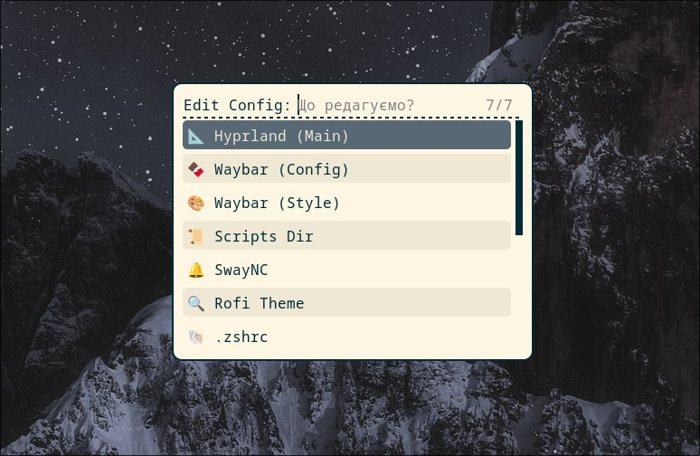
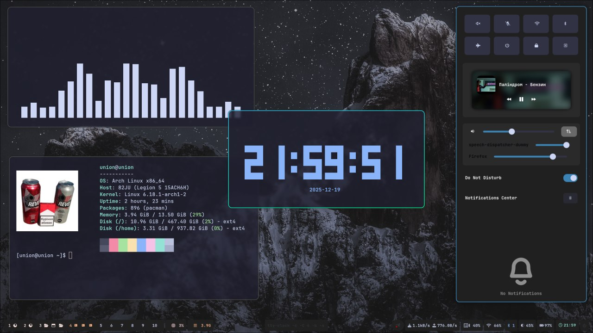

# UA_arch_dotfiles
Вітаю! Мій перший кастом гіперленду на арчі. Постараюсь оновлювати та шось додавати.
# 🛠️ Dotfiles by [union]  

  

## 🚀 Про систему
Цей репозиторій містить мої персональні налаштування для створення простого та робочого середовища на Arch Linux з Hyprland (Wayland). Все працює для щоденного використання та навчання.

## 📦 Що тут є?
* **WM:** Hyprland (мій віконний менеджер на Wayland)
* **Terminal:** Kitty (з кастомними темами та прозорістю)
* **Shell:** Bash (налаштування оболонки)
* **Bar:** Waybar (кастомна панель)
* **Fetch:** Fastfetch (з унікальним ASCII-логотипом)
* **App Launcher:** Rofi (швидкий запуск додатків)
* **Notifications:** SwayNC (центр сповіщень)
* **System Monitor:** Btop (моніторинг ресурсів у терміналі)
* **Wallpaper:** через Rofi
* **Clock:** Tty-clock (термінальний годинник)

## ✨ Особливості
* **Ефективні гарячі клавіші:** Оптимізовані для швидкої навігації та керування вікнами.

| Комбінація клавіш   | Дія                       | Команда / Опис         |
| ------------------- | ------------------------- | ---------------------- |
| `SUPER + Enter`     | Відкрити термінал         | `kitty`                |
| `SUPER + E`         | Файловий менеджер         | `thunar`               |
| `SUPER + Q`         | Закрити активне вікно     | `killactive`           |
| `SUPER + M`         | Вийти з Hyprland          | `exit`                 |
| `SUPER + V`         | Floating режим            | `togglefloating`       |
| `SUPER + D`         | Меню програм              | `rofi -show drun`      |
| `SUPER + Shift + S` | Скріншот області → буфер  | `grim + slurp`         |
| `SUPER + W`         | Вибір шпалер              | `wallpaper_select.sh`  |
| `SUPER + A`         | Центр сповіщень           | `swaync-client -t -sw` |
| `SUPER + Shift + D` | Показати / сховати Waybar | `SIGUSR1 waybar`       |
| `SUPER + Shift + f` | Доступ до конфіга         | `Script`       |

| Комбінація             | Дія                  |
| ---------------------- | -------------------- |
| `SUPER + 1..9`         | Перейти на workspace |
| `SUPER + 0`            | Workspace 10         |
| `SUPER + Shift + 1..9` | Перемістити вікно    |
| `SUPER + Tab`          | Наступний workspace  |
| `SUPER + Shift + Tab`  | Попередній workspace |

## **🚀 Автозапуск програм**

Автозапуск у Hyprland налаштовується через директиву exec-once.
| Рядок                     | Що робить    |
| ------------------------- | ------------ |
| `exec-once = waybar`      | Панель       |
| `exec-once = swww-daemon` | Демон шпалер |
| `exec-once = swaync`      | Сповіщення   |
| `exec-once = eww daemon`  | Віджети      |

## **Додати нову *програму* в автозапуск:**
exec-once = **назва**

## **⌨️ Кейбінди (гарячі клавіші)**

*Усі бінди оголошуються через *bind.*

| Змінна      | Значення                  |
| ----------- | ------------------------- |
| `$mainMod`  | `SUPER` (Windows клавіша) |
| `$terminal` | `kitty`                   |
| `$menu`     | `wofi` або `rofi`         |

Приклад:

bind = $mainMod, E, exec, thunar

bind = $mainMod SHIFT, S, exec, grim -g "$(slurp)" - | wl-copy**

## 🚀 Встановлення (для Arch Linux)

У майбутньому..

## 📸 Скріншоти

  
  

